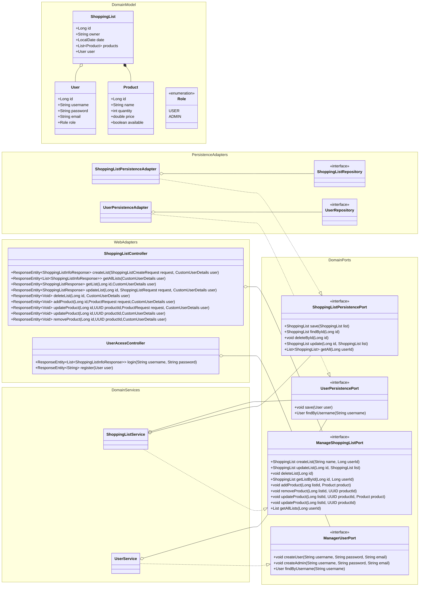

# CartMateHex

CartMateHex é uma aplicação de gerenciamento de listas de compras com suporte a autenticação de usuários, desenvolvida usando a arquitetura hexagonal (ports and adapters) e utilizando **Spring Boot** no backend.

## Estrutura

```
├───src
│   ├───main
│   │   ├───java
│   │   │   └───br
│   │   │       └───dev
│   │   │           └───drufontael
│   │   │               └───CartMateHex
│   │   │                   ├───adapter
│   │   │                   │   ├───persistence
│   │   │                   │   │   └───repository
│   │   │                   │   │       └───entity
│   │   │                   │   └───web
│   │   │                   │       └───dto
│   │   │                   ├───domain
│   │   │                   │   ├───exception
│   │   │                   │   ├───model
│   │   │                   │   ├───port
│   │   │                   │   │   ├───in
│   │   │                   │   │   └───out
│   │   │                   │   └───service
│   │   │                   └───infrastructure
│   │   │                       ├───configuration
│   │   │                       │   ├───beans
│   │   │                       │   ├───documentation
│   │   │                       │   │   └───api
│   │   │                       │   └───security
│   │   │                       └───dev

```

## Diagrama de classes



## Funcionalidades

- Cadastro de usuários com roles (USER, ADMIN).
- Autenticação de usuários com controle de sessão.
- CRUD completo para listas de compras.
- Gerenciamento de produtos dentro das listas de compras.
- Documentação da API com Swagger.
- Testes unitários e de integração. *Implementação futura*

## Tecnologias

- **Java 17**
- **Spring Boot**
- **Spring Security**
- **Spring Data JPA**
- **H2 Database** (banco em memória para desenvolvimento)

## Arquitetura

O projeto segue a arquitetura hexagonal, dividindo o código em:

- **Core**: Regras de negócio e entidades.
- **Adapters**: Comunicação com o mundo externo (banco de dados, APIs externas, etc).
- **Ports**: Interfaces para comunicação entre o core e os adapters.

## Configuração

### Pré-requisitos

- **Java 17** ou superior
- **Maven**
- **Docker** (opcional, para rodar banco de dados externo)

### Passos para rodar o projeto

1. Clone o repositório:

   ```bash
   git clone https://github.com/Drufontael/CartMateHex.git
   ```
   
2. Entre no diretório do projeto:
    ```bash
   cd CartMateHex
   ```

3. Configure o banco de dados H2 no arquivo ```application.properties```:
    ```properties
    spring.datasource.url=jdbc:h2:mem:cartmatehex 
    spring.datasource.username=user
    spring.datasource.password=123
    spring.h2.console.enabled=true
    spring.h2.console.path=/h2-console
   ```
4. Rode o projeto:
    ```bash
   mvn spring-boot:rum
   ```
5. Acesse a documentação:
    ```url
    http://localhost:8080/swagger-ui.html
    ```
   
## Autenticação

A aplicação utiliza Spring Security para autenticação e autorização. Algumas rotas são protegidas e exigem um usuário autenticado com a role apropriada (ex: ADMIN para rotas administrativas).

### Endpoints públicos:
- ```/api/v1/auth/register``` -- Cadastro de novo usuario
- ```/api/v1/auth/login``` -- Login de usuario cadastrado
- ```/swagger-ui.html``` -- Documentação

## Contribuição

Contribuições são bem-vindas! Para contribuir, siga os passos abaixo:

1. Faça um fork do repositório.
2. Crie uma branch para sua feature/fix (git checkout -b minha-feature).
3. Faça commit das suas alterações (git commit -m 'Minha nova feature').
4. Envie para o repositório (git push origin minha-feature).
5. Abra um Pull Request.

## Licença

Este projeto está licenciado sob a MIT License. Veja o arquivo [LICENSE](LICENSE) para mais detalhes.
